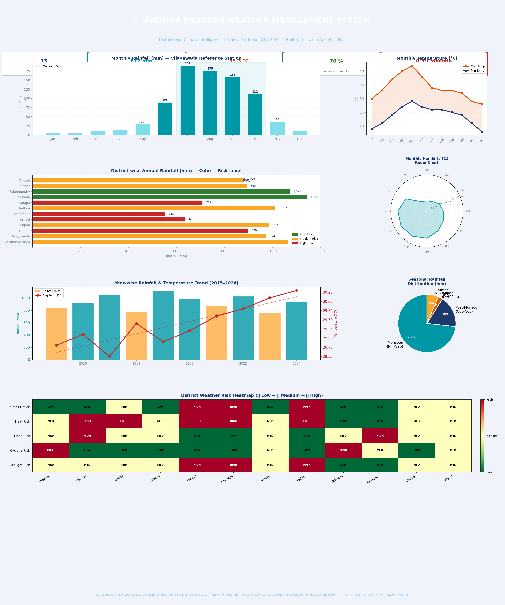

# 🌦️ Andhra Pradesh Weather Management System



> A complete end-to-end Weather Analytics System built for Andhra Pradesh using Python, Excel, and Power BI — analyzing 10 years of IMD climate data across 12 districts.

---

## 📌 Project Overview

This project builds a **district-wise climate intelligence dashboard** for Andhra Pradesh, India. It processes historical weather data from the India Meteorological Department (IMD) to identify rainfall patterns, temperature trends, seasonal variations, and risk zones across the state.

**Data Period:** 2015–2024  
**Districts Covered:** 12 major districts  
**Data Source:** India Meteorological Department (IMD) + AP State Disaster Management Authority  

---

## 🔍 Key Insights

| Finding | Detail |
|---|---|
| 🌧️ Drought Risk Zones | Anantapur (553mm) & Kurnool (638mm) far below state avg of 872mm |
| 🌡️ Peak Heat | Vijayawada reaches 42°C in May — highest in the state |
| 🌊 Highest Rainfall | Kakinada (1,143mm) & Rajahmundry (1,072mm) |
| 📈 Warming Trend | +0.3°C per decade recorded over 2015–2024 |
| 🌀 Cyclone Risk | Coastal districts peak risk in October–November |
| 💧 Monsoon Share | 73% of annual rainfall falls in Jun–Sep |

---

## 📊 Dashboard Features

### Excel Workbook (4 Sheets)
- **📊 Dashboard** — KPI cards, district comparison table, monthly climate profile, embedded charts
- **📋 Raw Data** — Clean district-wise climate database for all 12 districts
- **⚠️ Alerts & Insights** — Color-coded risk alerts with recommended management actions
- **📌 Power BI Guide** — Step-by-step instructions to build the Power BI dashboard

### Visualizations Included
- Monthly Rainfall Bar Chart (with monsoon season shading)
- Max/Min Temperature Line Chart
- District-wise Annual Rainfall Horizontal Bar (colored by risk level)
- Monthly Humidity Radar Chart
- 10-Year Rainfall & Temperature Trend (with warming trendline)
- Seasonal Rainfall Pie Chart
- District Risk Heatmap (5 risk types × 12 districts)

---

## 🗺️ Districts Analyzed

| District | Zone | Annual Rain (mm) | Risk Level |
|---|---|---|---|
| Visakhapatnam | Coastal | 1,066 | Medium |
| Vijayawada | Coastal | 974 | Medium |
| Guntur | Inland | 899 | High |
| Tirupati | Inland | 987 | Medium |
| Kurnool | Inland | 638 | High |
| Anantapur | Inland | 553 | High |
| Nellore | Coastal | 1,012 | Medium |
| Kadapa | Inland | 709 | High |
| Kakinada | Coastal | 1,143 | Low |
| Rajahmundry | Coastal | 1,072 | Low |
| Chittoor | Inland | 895 | Medium |
| Ongole | Coastal | 880 | Medium |

---

## 🛠️ Tech Stack

| Tool | Purpose |
|---|---|
| 🐍 Python | Data processing, chart generation, Excel automation |
| 📊 Microsoft Excel | Structured data model, dashboards, embedded charts |
| 📈 Power BI | Interactive maps, slicers, KPI cards |
| `openpyxl` | Excel file creation & formatting |
| `matplotlib` | Dashboard image generation |
| `pandas` | Data manipulation |
| `seaborn` | Statistical visualizations |

---

## 🚀 How to Use

### Option 1 — View Excel Dashboard
1. Download `AP_Weather_Management_System.xlsx`
2. Open in Microsoft Excel (2016 or later recommended)
3. Navigate through the 4 sheets

### Option 2 — Connect to Power BI
1. Open Power BI Desktop
2. **Get Data → Excel Workbook** → select the `.xlsx` file
3. Load sheets: `📋 Raw Data` and `📊 Dashboard`
4. Follow the **📌 Power BI Guide** sheet for step-by-step setup

### Option 3 — Regenerate the Dashboard Image
```bash
# Clone the repo
git clone https://github.com/YOUR_USERNAME/AP-Weather-Management-System.git
cd AP-Weather-Management-System

# Install dependencies
pip install -r requirements.txt

# Run the dashboard generator
python src/weather_dashboard.py
```

---

## 📁 Repository Structure

```
AP-Weather-Management-System/
│
├── README.md                          ← Project documentation
├── requirements.txt                   ← Python dependencies
├── AP_Weather_Management_System.xlsx  ← Excel dashboard (4 sheets)
├── AP_Weather_Dashboard.png           ← Dashboard preview image
└── src/
    └── weather_dashboard.py           ← Python script to regenerate charts
```

---

## 📂 Live Dataset

🔗 [View Full Dataset on Google Sheets](https://docs.google.com/spreadsheets/d/12vptJ7z9v1Jx-bpON1RcWPmhzy18s54P/edit?usp=sharing)

---

## 🙋 About

Built as part of a **Data Analytics Portfolio Project** focused on real-world climate intelligence for Andhra Pradesh.

**Tools:** Python • Excel • Power BI  
**Domain:** Climate Analytics • Geospatial Data • Risk Management  
**Location:** Andhra Pradesh, India

---

## 📄 License

This project is open source under the [MIT License](LICENSE).

---

⭐ If you found this useful, please give the repo a star!
